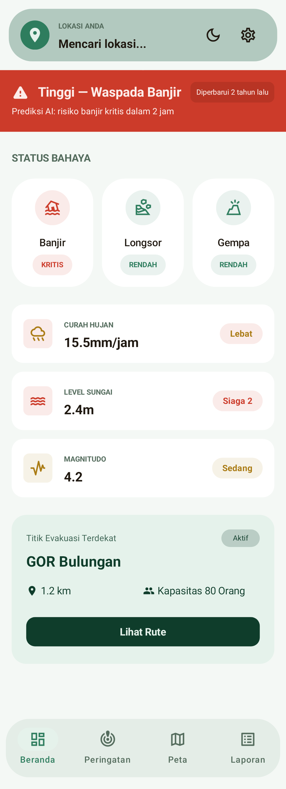
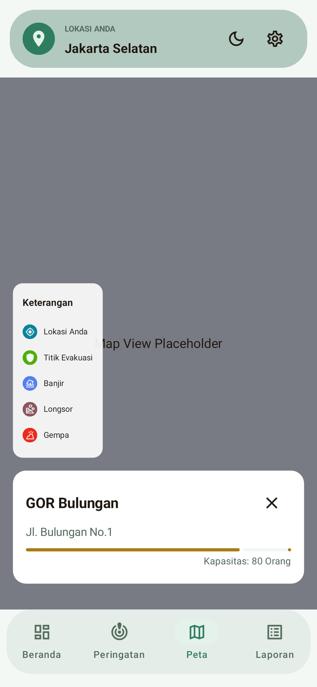
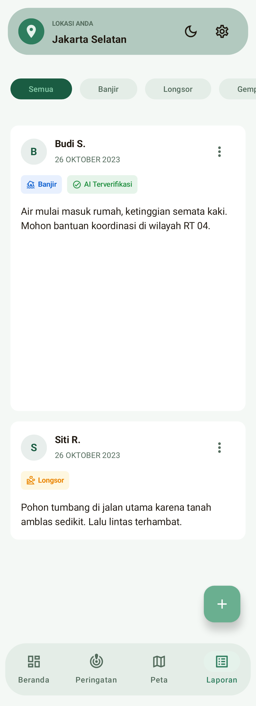

# PantauBumi
*A robust, real-time disaster tracking and community lifeline built natively for Android.*

**PantauBumi** is a portfolio-grade Android application engineered to empower communities with real-time disaster tracking, crowdsourced hazard reporting, and live evacuation routing. Built completely with **Kotlin** and **Jetpack Compose**, it showcases advanced Android development patterns, offline-first resilience, and high-performance map rendering.

---

## Screenshots

  
  &nbsp;&nbsp;&nbsp;
  
  &nbsp;&nbsp;&nbsp;
  

---

## The Vision

During environmental crises, network stability is unreliable and time is critical. PantauBumi solves this by providing a hyper-local, community-driven map that syncs crucial hazard zones in the background, calculates the fastest routes to safety, and works persistently even when the connection drops.

## Technical Highlights

### High-Performance Vector Mapping
Replaced standard mapping solutions with **MapLibre Native** to render completely customized, low-latency vector tiles. Dynamic map markers representing different disaster threats (Floods, Landslides, Earthquakes) are painted seamlessly onto the map, with custom UI overlay layers.

### Algorithmic Evacuation Routing
Integrates the **Open Source Routing Machine (OSRM)** API. When a user selects a designated evacuation shelter, the app dynamically constructs a GeoJSON route polygon, renders it on the map, and algorithmically animates the camera viewport to precisely frame both the user's live GPS location and the destination.

### Offline-First Resilience & Sync
Disasters knock out networks. PantauBumi is backed by a **Room Database** acting as a single source of truth. Background synchronization occurs securely using Android **WorkManager** (`MapDownloadWorker` and `SyncWorker`), eagerly pre-fetching map areas and critical alert data so the app remains entirely functional when offline.

### Live Crowdsourced Reporting
Enables on-the-ground users to snap photos and tag GPS coordinates of sudden hazards. This utilizes secure Multipart network requests via **Retrofit** and **OkHttp**, surfacing vetted community reports directly back onto the global live map.

### Instant Hazard Telemetry
Powered by **Firebase Cloud Messaging (FCM)**, the app delivers localized, instant push-notifications to alert communities of sudden high-risk environmental shifts.

---

## Architecture & Engineering

This project was built from the ground up prioritizing scalability, clean code, and modern Android standards:

- **Architecture Strategy:** Strict **MVVM (Model-View-ViewModel)** adhering to Clean Architecture principles.
- **UI Toolkit:** Beautiful, reactive, fluid animations written 100% in **Jetpack Compose** (Material Design 3).
- **Dependency Injection:** Fully decoupled components managed by **Dagger Hilt**.
- **Network Layer:** Robust structured concurrency using Kotlin **Coroutines** and **Flow**, communicating securely over HTTPS via Retrofit and Kotlinx Serialization.
- **Data Persistence:** Local caching via **Room Database** and user preferences handled by **DataStore**.
- **Security:** Zero hardcoded credentials. All API endpoints and Keystore secrets are dynamically extracted from excluded localized properties, and wildcard HTTP traffic is deliberately constrained.

---

*PantauBumi represents the intersection of technical excellence, fluid UI/UX, and technology built for human impact.*
